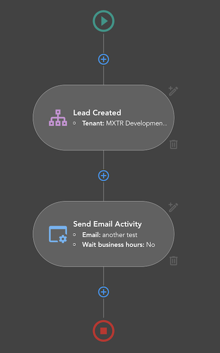
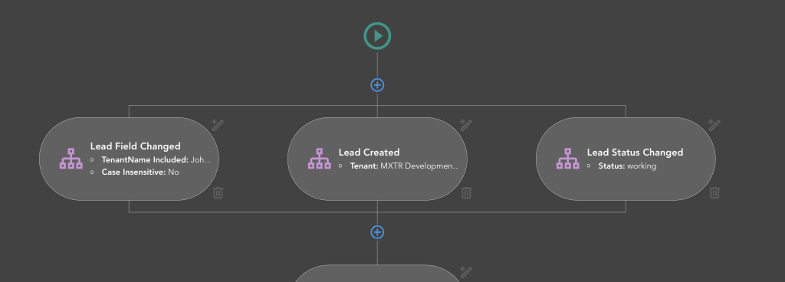

# {{ $page.title }}

Workflows (or Campaigns) is an important part of the core-user-dash project. Its functionality allows the users (tenants)
create some kind of schemas which then could be executed.

Workflow allows the users to automate some processes and actions under own leads (clients or contacts). The simplest 
workflow can look like this:

## Workflow sections
On the image above you can see typical example of the workflow which contains 4 items - **Sections**. First and last - are automatically 
generated sections, next statements are valid for them:
- Workflow always starts from **Start Section** 
- Each workflow branch (current workflow has only one branch) must be ended with **Finish Section**

Second one is a trigger section or just **Trigger** - this type of sections usually begins the workflow, we can say that
"Any workflow starts its execution form Trigger". The Workflow can have multiple triggers at the beginning, 
which means that list of the actions which laying under triggers can be executed multiple times depending on trigger event:

Third section is an action section or just **Action**. Actions can do some work for your leads, for example "Send an Email" 
or "Change Lead Status" and many other things. Usually Actions on the Workflows  stands vertically when Triggers mostly 
horizontally.

We've just seen 4 main section types: 
- Start
- Finish
- Trigger
- Action

Check the full list of sections and their types: [Workflow sections](/workflows/sections)